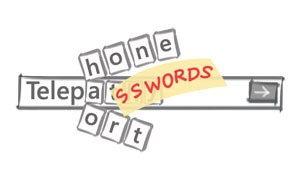

> [!NOTE]
> “You can move all your eggs to one basket,” he says, “but in the end, there’s usually a password protecting that basket.”

> [!TIP] Source link: [Avoiding Vulnerable Passwords—and Rules, Too](https://www.microsoft.com/en-us/research/blog/avoiding-vulnerable-passwords-rules/)

<!-- more -->

 

---

 
 

You could think of it as a brainteaser: Create a sequence of eight or more characters that includes at least one uppercase letter, one lowercase letter, a digit, and a symbol, that doesn’t contain any words in English, and that is memorable enough that you can recall it.

For most of us, unfortunately, the challenge posed by these rules isn’t fun—it’s a painful chore forced upon us when choosing a password to access an email account, a company network, or a website.

Passwords that contain symbols and uppercase letters to meet these rules also tend to be difficult to type, especially on mobile devices.

Even worse, adhering to the rules doesn’t guarantee that your account or your password-protected data will remain secure. A surprising number of passwords that follow these rules are easily guessed by malicious hackers: `“P@$$w0rd1,”` for example, or `“Qwerty123!”`. If you specify one of these passwords, most login systems won’t raise any objections.

For ordinary users, as well as entire organizations, this state of affairs has potentially serious implications. For [Stuart Schechter](https://www.microsoft.com/en-us/research/people/stus/) of Microsoft Research and several of his colleagues, it presented a compelling challenge: finding a way to help users avoid “weak” passwords—those that might be too easy for attackers to guess—that were allowed under the old rules, while simultaneously enabling users to choose passwords that are easy to type.

Schechter, who studies the intersection of human behavior and computer security, is no stranger to debunking conventional wisdom about identity authentication. Several years ago, he and two collaborators wrote a paper revealing the risks of using “secret questions” as a secondary authentication measure when users need to reset a password.

This time, with access to a huge store of publicly available data on password use and password-setting habits, Schechter and his colleagues— [Cormac Herley](https://www.microsoft.com/en-us/research/people/cormac/), [Bo-June (Paul) Hsu](https://www.microsoft.com/en-us/research/people/paulhsu/), [Ricky Loynd](https://www.microsoft.com/en-us/research/people/riloynd/), and former Microsoft Research intern and Carnegie Mellon University Ph.D. candidate [Saranga Komanduri](http://www.salsite.com/cv/) —have created a tool that detects password vulnerability while forsaking password-strength rules that have been in force for more than 30 years.

 The free online research tool, launched December 5, is called [Telepathwords](https://telepathwords.research.microsoft.com/). Users can visit the project website and test the strength of their passwords—current ones, past ones, or ones they’re considering using.

“The system doesn’t ask the user to learn anything up-front or follow any specific rules,” Schechter says. “Rather, as you type each key of your intended password, it displays the characters it thinks you’re most likely to type next. If it succeeds in predicting one or more characters of the rest of your password, the evidence that these characters are predictable will be right in front of your eyes.”

The user interface for Telepathwords makes it easy to assess the security of the password you’re considering.

Using Telepathwords feels similar to the autocomplete feature in search engines, except that it discourages you from following its predictions. Predictable characters don’t do much to increase the security of your password against those who might try to guess it, so if you type one of the three characters predicted by Telepathwords, a red X will appear above it. If you choose a character that is not among those predicted by Telepathwords, a green checkmark will appear above it.

While not truly telepathic, Telepathwords is endowed with great deal of knowledge about how users choose passwords. It knows all the usual substitutions, such as substituting the dollar sign ($) for an S. Telepathwords also looks for passwords constructed by moving a finger around the keyboard, regardless of direction. It has an extensive list of known-popular passwords, as well as a dictionary of English words and a list of common phrases obtained from Microsoft’s [Bing](http://www.bing.com/) search engine. And it’s wise to all sorts of tricks that users have devised—and attackers have long recognized—such as putting an asterisk between the letters of a familiar word.

Telepathwords also responds—with a diplomatically worded pop-up message—to passwords that rely on common substitutions or contain profanity, both of which attackers also are keenly aware.

The team tested Telepathwords with several hundred Microsoft employees who shared some of their favorite password-creation tactics to see if Telepathwords would detect them.

“We saw firsthand the tricks people use to construct passwords and then figured out which ones we should assume attackers also know,” Schechter says. “We then refined the system to detect these ill-advised password-creation behaviors.”

## Managing Passwords’ Flaws

Even if Telepathwords succeeds in helping users choose passwords they can remember and are hard for others to guess, some users will still forget their passwords, and passwords too complex to guess can be stolen in other ways. Schechter, who joined Microsoft Research in 2007 after getting his Ph.D. from Harvard University and spending three years at the Lincoln Laboratory at the Massachusetts Institute of Technology, started working on the problem of what to do when passwords are lost or compromised shortly after joining Microsoft.

It used to be that if websites didn’t have an email address at which a user could obtain a password-reset code, the gold standard for verifying a user’s identity was to ask a so-called “secret” question—such as “who’s your favorite historical figure?” or “what’s your favorite sports team?”—that the users answer when they first establish an account.

Schechter, [A.J. Brush](https://www.microsoft.com/en-us/research/people/ajbrush/), and Microsoft Research intern [Serge Egelman](http://www.guanotronic.com/~serge/), now a researcher at the University of California, Berkeley and the International Computer Science Institute, [studied about two dozen of these questions](https://www.microsoft.com/en-us/research/publication/its-no-secret-measuring-the-security-and-reliability-of-authentication-via-secret-questions/). They found that the answers to most were remarkably easy to predict.

It turns out that a lot of Americans admire the presidents they learned about in elementary school and root for their local sports teams. The few questions that didn’t have predictable answers were forgotten too often.

The timing of that research project was impeccable. The week in 2008 that the researchers submitted their paper about secret questions, news outlets around the world reported that vice presidential candidate Sarah Palin’s email account had been hacked. The weakness that enabled access to her account? The secret question about where Palin had met her husband, which was widely known to have been in high school in Wasilla, Alaska.

Schechter and his colleagues take the same intuitively simple approach to those common answers that they do with common passwords: Choose a different question if your answer is popular enough that an attacker is likely to guess it.

Their paper on secret questions led major providers of webmail and other high-value Internet services to start shifting away from the use of secret questions. Many augmented email-based verification with text messages sent to mobile phone numbers. Facebook adopted another approach pioneered by Schechter and colleagues: relying on users’ [trusted friends](https://www.microsoft.com/en-us/research/publication/its-not-what-you-know-but-who-you-know-a-social-approach-to-last-resort-authentication/) and family members to verify their identity.

## The End of Passwords?

As for the question of whether password authentication soon will become obsolete, Schechter notes that such predictions have been around as long as passwords have been used online. He points to [work by Herley and others](https://www.microsoft.com/en-us/research/publication/the-quest-to-replace-passwords-a-framework-for-comparative-evaluation-of-web-authentication-schemes/) that documents the reasons why other technologies have failed to replace passwords and why they are unlikely to do so in the future. For example, credentials that you carry with you are easy to forget and, like passwords, can be stolen.

Schechter explains that as people start to log on to websites using email or social-media accounts, or to use a master password to keep their other passwords safe, they are increasing the importance of the passwords, which suddenly control even more resources.

“You can move all your eggs to one basket,” he says, “but in the end, there’s usually a password protecting that basket.”

Seeing is believing: Check the [Telepathwords](https://telepathwords.research.microsoft.com/) site, and learn how your passwords fare. You might be surprised.
