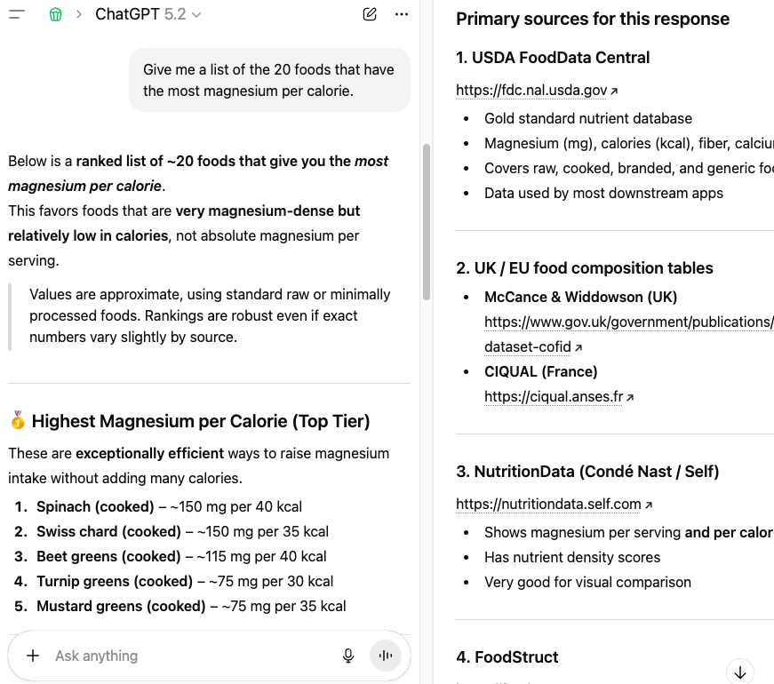

> [!NOTE]
> If we want to avoid the great content collapse, we need a model of GenAI usage that creates opportunities for all parties (user, GenAI company, content creator) to capture value.

> [!TIP] Source link: [GenAI, The Snake Eating Its Own Tail: How tools like ChatGPT and Claude are destroying the ecosystems they rely on, and what to do about it](https://www.ybrikman.com/blog/2026/01/21/gen-ai-snake-eating-its-own-tail/)

<!-- more -->

 

---

 
 

Generative artificial intelligence (GenAI) tools such as ChatGPT and Claude have two superpowers. The first superpower is a boon: they can dramatically increase human productivity. I use them on a regular basis to answer questions, learn new skills, write code, create images, and much more, all at a rate of speed and quality that was science fiction just a few years ago. The second superpower is a bane: GenAI is quietly destroying the very ecosystems that made it possible in the first place.

Under the hood, GenAI is built on large language models (LLMs), which are able to extract patterns, structure, and statistical relationships from massive data sets. These data sets consist primarily of content created by human beings: books, blog posts, articles, forum discussions, open source code, art, photography, and so on. LLMs are able to extract value from this content at an unprecedented scale, but all that value is captured by the GenAI company and its users. If you’re a content creator, you get nothing: no attribution, no referral traffic, no revenue share. Not even a thank-you.

This feels unsustainable to me, a bit like a snake eating its own tail. In this blog post, I’ll go through three examples of how GenAI is destroying the very ecosystems it relies on, and then discuss possible solutions that may give everyone (users, GenAI companies, and content creators) more value.

## Example #1: online communities

For many years, [StackOverflow](https://stackoverflow.com/) was the most popular Q&A site for programmers. Any time you hit a weird error while coding, you’d do a search on Google, and more often than not, find a good answer on StackOverflow. But now, in large part due to GenAI, StackOverflow is nearly dead:

[StackOverflow questions over time. Source: Marc Gravell.](https://x.com/marcgravell/status/1922922817143660783/photo/1)

Although StackOverflow’s decline started before GenAI went mainstream (ChatGPT was first released in 2022), GenAI accelerated that decline considerably. That’s because nowadays, instead of searching around for an answer on a Q&A site, and working to adapt that answer to your own codebase, you can ask GenAI tools to generate your code, fix any errors you hit, answer any questions you run into, and so on. As a result, you’re considerably more productive.

But it doesn’t seem sustainable. A big part of why GenAI tools can answer programming questions and fix errors in your code is because those tools were trained on StackOverflow data. So you as a programmer and the GenAI tool now get much more value from that data, but StackOverflow gets none. If people stop asking and answering questions, what will GenAI train on in the future?

I also get the impression that StackOverflow is not the only online community where this is happening. For example, [Quora seems largely dead](https://slate.com/technology/2024/02/quora-what-happened-ai-decline.html). [Wikipedia is facing more threats than ever](https://www.wired.com/story/wikipedias-existential-threats-have-never-been-greater/). And although Reddit’s traffic numbers don’t show it, I (and many other Redditors) get the impression that it’s also dying.[^1]

## Example #2: open source

[Tailwind CSS](https://tailwindcss.com/) is a popular library programmers use to style and decorate their websites. In fact, according to the [2025 State of CSS Survey](https://2025.stateofcss.com/en-US/other-tools/), Tailwind is the most popular CSS library, by far:

[Source: 2025 State of CSS Survey.](https://2025.stateofcss.com/en-US/other-tools/)

And Tailwind usage only seems to be growing:

[Source: Star History.](https://www.star-history.com/#tailwindlabs/tailwindcss&type=date&legend=top-left)

Despite that, just a couple of weeks ago, [the Tailwind team had to lay off 75% of its staff](https://github.com/tailwindlabs/tailwindcss.com/pull/2388#issuecomment-3717222957). Why? The company behind Tailwind CSS makes its money by selling a premium upgrade to the open source library called [Tailwind UI](https://tailwindcss.com/plus), which gives you a set of reusable, pre-built, professionally designed components for building out your website. This was a great offering in the past, but in the age of GenAI, it’s more problematic:

1. **Less traffic.** Traffic to the Tailwind docs site is down by more than 40%, so fewer developers are discovering that a paid Tailwind UI library exists. This is probably because developers are using GenAI to write their code, and therefore, rarely have to look at docs anymore.
2. **Less need.** Whereas in the past, buying Tailwind UI would be a huge win in terms of speed (not having to build those components from scratch) and quality (not everyone has access to top-notch designers), these days, you can get GenAI to generate CSS components quickly and with high quality, at no additional cost. In fact, GenAI tools can rapidly copy almost anyone’s work—not just a library like Tailwind UI, but almost any design, any SaaS tool, and so on—while giving no attribution back to the original creators.

So developers are getting lots of value from Tailwind, GenAI is getting lots of value from Tailwind, but the creators of Tailwind are getting crushed. I suspect something similar will happen with many other open source projects.[^2]

## Example #3: books and blogs

[Fundamentals of DevOps and Software Delivery](https://www.fundamentals-of-devops.com/)

When my latest book, *[Fundamentals of DevOps and Software Delivery](https://www.fundamentals-of-devops.com/)*, came out last year, a friend of mine asked me an interesting question:

> In the age of LLMs, will people still use books to learn the fundamentals?

I’m an avid reader, and still believe books play a key role in learning, but there’s no doubt that LLMs provide a new method of learning that is incredibly compelling. GenAI has two remarkable qualities that make it a great teacher:

1. It has infinite patience.
2. It never judges you.

You can ask it all the questions you want, with no fear of sounding dumb. You can repeat the same question over and over again if something isn’t clicking. You can request it to explain things in different ways: via text, via audio, via diagrams. I’ve used GenAI to learned dozens of new things over just the last few months: how to do DIY projects around the house, how to rehab a minor injury, how to cook eggs without giving them a sulfuric taste/smell, and much more. And I learned most of these without reading anyone’s book or blog.

And that’s a problem. Much of the content I got from the GenAI tools was extracted from books and blog posts, with no attribution. Even worse, some of this content was extracted illegally. Last year, [Anthropic agreed to pay $1.5B to settle a class-action lawsuit](https://www.theguardian.com/technology/2025/sep/05/anthropic-settlement-ai-book-lawsuit) for training their LLMs on over 500,000 pirated books. That included several of my previous books![^3]

This class-action lawsuit might sound like a win for authors, but it’s actually a disaster. There are likely many AI companies training on pirated data who haven’t been caught. And even if they are caught, they might not be sued. And even if they are sued, they might not lose or settle. And even if they do, they will just see it as the *cost of doing business*. Anthropic recently [raised $13B, reported revenue at $5B per year, and is valued at $183B](https://www.anthropic.com/news/anthropic-raises-series-f-at-usd183b-post-money-valuation); OpenAI is trying to [raise $100B, with reported revenue of $20B per year, and a valuation of $830B](https://techcrunch.com/2025/12/19/openai-is-reportedly-trying-to-raise-100b-at-an-830b-valuation/). And all these numbers are growing fast. A $1.5B fine is just a drop in the bucket for companies like this. It’s a risk worth taking.

And I’m guessing all the GenAI companies are taking that risk. In another lawsuit, [OpenAI argued that it’s ‘impossible’ to create AI tools like ChatGPT without copyrighted material](https://www.theguardian.com/technology/2024/jan/08/ai-tools-chatgpt-copyrighted-material-openai). If that’s what it takes to get to an $830B valuation, you better believe they are all going to steal and pirate as much content as possible. And when they do, the creators of that content will get nothing. Nada. $0.

## The GenAI model is broken

There are countless other examples where GenAI is benefiting from content, while giving nothing back to the content creators: e.g., art, music, design, movies, copywriting, and so on. At its root, the GenAI model is broken:

1. **Create.** Someone creates valuable content.
2. **Extract.** A GenAI bot crawls the web, exacting all the valuable content.
3. **Subscribe.** Users pay money to use a GenAI tool. This provides value to the GenAI company.
4. **Prompt.** Users enter a prompt into a GenAI tool, which generates a response based on the content it extracted. The response provides value to the user.

Did you notice what’s missing? The user has a way to get value (step 4), the GenAI company has a way to get value (step 3), but the content creator gets nothing. Compare this to the search engine model (e.g., Google Search), which is what we all used before GenAI came along:

1. **Create.** Someone creates valuable content.
2. **Extract.** A search bot crawls your website to extract the content.
3. **Prompt.** Users enter a prompt into the search engine, and the search engine shows links to websites that match the prompt, with the most relevant websites at the top. This provides value to the user.
4. **Bid.** The search engine also allows companies to bid on search terms. The highest bids get to show their links at the top of the search results, clearly marked as a “sponsored result.” The money companies pay for bids provide value to the search engine company.
5. **Referral.** The user clicks on a link, ending up on the content creator’s website. This provides value to the content creator.

The search engine model was not perfect, but it at least created the opportunity for all parties in this three-sided marketplace to capture value: the user in step 3, the search engine company in step 4, and the content creator in step 5.

In short, the current GenAI model destroys the incentives to create new content. I’ve heard this referred to as “the great content collapse.” Will it lead to a world where, after the 2020s, there’s little-to-no content created by humans? Will the state of knowledge and creativity stagnate as a result?

To be clear, I’m not an innocent party in this. As I mentioned numerous times in this post, I use GenAI regularly. There’s no doubt that it makes me more productive. I even used GenAI to create the cover image for this blog post! But each time I use ChatGPT or Claude, I feel a bit guilty, as it doesn’t feel sustainable. The snake can’t keep eating its own tail indefinitely.

So the question is, what do we do? If we want to avoid the great content collapse, we need a model of GenAI usage that creates opportunities for all parties (user, GenAI company, content creator) to capture value. Below are two ideas for how we might accomplish this.

## Possible solution #1: pay-per-crawl

[CloudFlare's pay-per-crawl](https://blog.cloudflare.com/introducing-pay-per-crawl/)

The only attempted solution I’ve heard about so far is CloudFlare’s *[pay-per-crawl model](https://blog.cloudflare.com/introducing-pay-per-crawl/)*, which seems to work as follows:

1. **Block GenAI crawlers by default.** CloudFlare claims to be able to detect and block GenAI crawlers, so that, by default, they can’t extract content from your website.
2. **Charge GenAI crawlers for each crawl.** You can then selectively allow parts of your website to be accessed by GenAI crawlers in exchange for payment.

On the one hand, it’s fantastic to see a major company try to do something about this problem. On the other hand, this approach seems to address the wrong part of the problem. The real value isn’t in *crawling* the data, it’s in *using* it. For every one crawl, an LLM might use the data thousands or millions of times. If creators are only paid per crawl, then the GenAI company still captures 99.999% of the value, and the creator gets next to nothing. Moreover, this model only seems to work for websites (it’s not clear how you adapt it to books, art, music, etc.), and it creates an incentive for GenAI companies to only crawl free content, which means paid content is less likely to ever be discovered (which disproportionally benefits those with pockets deep enough to keep their content free).

## Possible solution #2: pay-per-use

I came across a clever solution that felt directionally correct from [this LinkedIn post by Tyrone Joel](https://www.linkedin.com/posts/tyrone-joel_terraform-aws-infrastructureascode-activity-7381711737760317440-0Z8h/?utm_source=share&utm_medium=member_desktop&rcm=ACoAAAD3mUgBN2d4Lp4yXa2xHHvuw58-BeMQc40) where he took a PDF of my book *[Terraform: Up & Running](https://www.terraformupandrunning.com/)*, uploaded it into a GenAI tool, and asked the tool to follow the guidance in the book to generate Terraform code. This feels like it has all the ingredients of a model of GenAI usage that is sustainable: the user gets value from the GenAI tool’s responses, the GenAI company gets value from the user paying for a subscription, and the content creator gets value from the user paying for their content (in this case, buying my book). This works fine for a single, specific piece of content, but how do you make it work at scale, across all the content that is consumed by an LLM?

Here’s a rough proposal for what I’ll call the *pay-per-use model*:

1. **Create.** Someone creates valuable content.
2. **Extract.** A GenAI bot crawls the web, exacting all the valuable content.
3. **Subscribe.** Users pay money to use a GenAI tool. This provides value to the GenAI company.
4. **Prompt.** Users enter a prompt into a GenAI tool. The GenAI tool generates a response based on the content it extracted. The response provides value to the user.
5. **Referral.** For each response, the GenAI tool lists the sources from which it extracted that content, perhaps formatted as a list of links back to the content creators, sorted by relevance, similar to a search engine (see the mock-up below). This provides value to the content creator. It also gives users additional value, as now you can check the sources of the information the GenAI tool is feeding you. Did that health advice come from a peer-reviewed article written by an expert or a random hoax someone posted from 4chan? Is that generated piece of code based on a hardened, mature library that’s been proven in production at thousands of companies or a totally untested snippet that’s full of security vulnerabilities that was thrown together by a junior programmer? Wouldn’t it be great to know?
6. **Revenue share.** GenAI tools could offer a revenue sharing model similar to the one used by subscription services such as Netflix, Spotify, and LinkedIn Learning: the more your content is used in GenAI responses (the more it shows up in the list of sources, as per the previous item), relative to all other content creators, the higher a cut of revenue you get. Content creators can prove they own various pieces of content (e.g., prove you own a certain domain name, open source project, or book) to claim their revenue cut.

A mock-up of how ChatGPT could include referrals to the sources it used to generate a response.

This model works for not only websites, but other types of content too, including copyrighted content. As a content creator (e.g., author, musician, designer, etc.), you could opt into sharing your copyrighted content with a GenAI company in exchange for getting referrals and revenue sharing each time your content is used. It might even help with making open source more sustainable, as open source creators could earn revenue and referrals each time a GenAI tool uses their code.

## Conclusion

It’s critical that we find a more sustainable model as soon as possible. The snake can’t eat its own tail indefinitely. And the snake—GenAI—isn’t going away. We can’t put the genie back in the bottle. In fact, it’s only going to get better, more ubiquitous, and to provide more and more value to users and GenAI companies. But if we can’t find a way to provide value to content creators too, then this will all fall apart.

That said, I don’t know enough about LLMs to say if a pay-per-use model is actually possible. Can LLMs track the source of the content they consumed? Will GenAI companies be willing to do a revenue sharing model? Will they be willing to be transparent about their sources and usage? What do you think? Let me know in the comments.

## Footnotes

[^1]: Many subreddits feel like a hollow shell of what they used to be. In part, this may be because a lot of the content in online communities now feels like it’s generated by bots (“AI slop”). But I think the bigger issue is that, just like StackOverflow, reading posts in online communities is no longer the best way to get answers. I used to use Reddit for research all the time; in fact, Google Search had gotten so bad, that you pretty much had to include “reddit” in your search queries to get a half-decent response. But nowadays, I use GenAI tools for much of my research. Just in the last few months alone, I’ve used ChatGPT and Claude to research solar panels, plan a trip to Norway, make changes to my diet, pick out new shoes for running, pick out new speakers for my living room, and dozens of other questions. Just a year ago, the vast majority of these questions would’ve brought me to Reddit. Nowadays, virtually none of them do, even though I suspect many of the responses I get from GenAI are based on Reddit content.

[^2]: I’m seeing more and more projects avoiding open source dependencies entirely, and instead having GenAI generate the all code they need directly in their own codebase. There are some benefits to this approach—faster builds, more reproducible builds, less supply chain risk—but it makes sustainably funding open source even harder. You spend years to create and share an open source library with the world, and a bunch of GenAI tools copy your code, with you getting zero credit or value back.

[^3]: How much will I get paid as a result of this settlement? It’s hard to know exactly, as it depends on how many authors end up submitting claims, but the current estimate is $3,000 per book, though that number is split with the publisher, so in practice, it’ll be closer to $1,500 per book. If you assume that a book takes just 3 months of full-time work, or about 500 hours (which is likely an under-estimate), and all you get is $1,500, that works out to about **$3/hour**. Writing non-fiction tech books was never a particularly lucrative affair, but $1,500 is just downright insulting. Worse yet, the other benefits you used to get as an author—recognition as an expert, invitations to talks, job opportunities, marketing for your company or consulting—are significantly reduced too, as far fewer people read your book, or are even aware that you wrote a book, as the LLM usually doesn’t attribute any of its knowledge back to the source.
