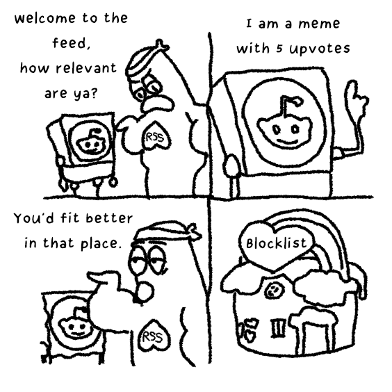
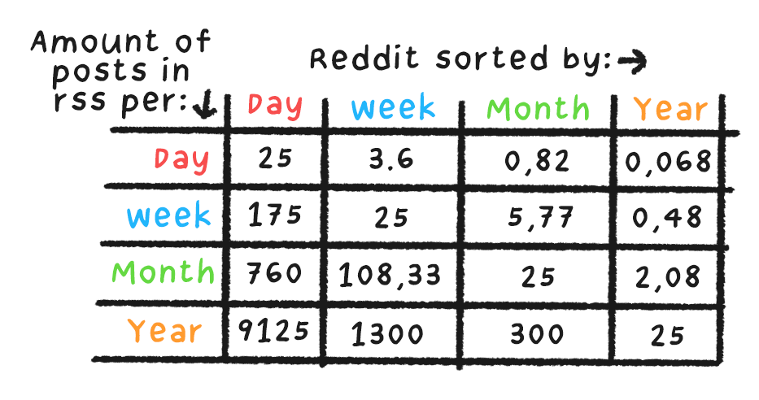
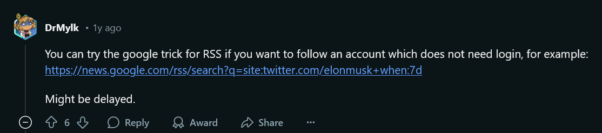

> [!NOTE]
> Never see noise, and never miss hidden gems again

> [!TIP] Source link: [I Ditched the Algorithm for RSS—and You Should Too - Joey's Hoard of Stuff](https://joeyehand.com/blog/2025/01/15/i-ditched-the-algorithm-for-rssand-you-should-too/#rss)

<!-- more -->

 

---

 
 

## I Ditched the Algorithm for RSS—and You Should Too

I waste too much time scrolling through social media. It's bad for my health, so why do I keep doing it?

Because once in a while, I'll find a post so good that it teaches me something I never knew before, and all the scrolling feels worth it. But I've stumbled upon an old piece of free and open source tech, relatively unknown today, which is THE solution of solving the problems with modern media without sacrificing accessible, good content: RSS.

Reddit, Facebook, Twitter — platforms built for engagement, not efficiency. Instead of showing you high-quality posts upfront, they pad your feed with memes, spam, and astroturfing. There is only so much 'good' content created in a day. By padding your feed with trash, they make the limited amount of good posts "last longer". These sites want you to spend more time scrolling on their website, so they feed you scraps which makes the occasional great post feels like a jackpot.

This concept, operant conditioning, was developed by B.F. Skinner — Yes, the mind behind the [Skinnerbox](https://www.simplypsychology.org/what-is-a-skinner-box.html).

While some sites offer filtering or sorting options, manually settings these options every time you want to access a subreddit is just not doable.

You could, of course, stop consuming content from these websites. However, this would mean potentially missing really good content; content you'd learn from, interesting ideas, and more.

But it doesn't have to be this way. You can reclaim your attention span while still having access to the same quality content as before.

Enter:

RSS is like your youtube subscription feed in hyperdrive. Subscribe to sites you love and decide what shows up — no exploitative social media algorithm needed. No more ads or algorithms deciding how to keep you doomscrolling. This 1999 tech actually solves a lot of 2025 problems.

Here's the kicker: Most websites, even social media, quietly support RSS feeds.

You can filter out keywords, set minimum upvotes or like counts, and much more! Modern RSS clients allow you to make filters using [Regex](https://developer.mozilla.org/en-US/docs/Web/JavaScript/Guide/Regular_expressions), and there are a *lot* of software and services you can use to tune up your filtering to 11.

TL;DR: Never see noise, and never miss hidden gems again!

But how do you get started with RSS? It's easier than you think!

## Setup

I personally [self-host](https://en.wikipedia.org/wiki/Self-hosting_\(web_services\)) an open source RSS reader: [Tiny Tiny RSS](https://tt-rss.org/)

If you don't want to host it yourself, you can google for companies offering easy and accessible RSS readers.

To make it easier, let's differentiate between three levels of ease when it comes to adding a website to RSS: Easy, medium, and hard.

I'll be going over how to add several popular sites to your feed.

### Easy 1: Youtube

Want a youtube channel in your RSS feed? Just copy the channel's URL and subscribe to it in your reader. Done.

### Easy 2: IGN

If you like games, you might want to subscribe to [IGN](https://ign.com/). There's no clear RSS button, so the best course of action would be to google "IGN RSS".

This leads to a nice [IGN RSS Feeds](https://corp.ign.com/feeds) page with multiple categorized feeds for you to pick from. If you wanted to subscribe to "Game Articles", you'd right-click on the game articles link, press "copy link", go to your RSS reader of choice and subscribe to the link you copied.

Now all IGN Game Articles will show up in your RSS feed as they are published!

Tip

Some websites don't have a dedicated RSS button, but still support RSS. You can discover their RSS urls by adding.rss, atom.xml, feed, etc. at the end of the site's URL, for example `https://website.com/atom.xml`. Almost all RSS readers support Atom feeds. For more examples, check [this](https://www.reddit.com/r/rss/comments/12782um/comment/jee0lpx/?utm_source=share&utm_medium=web3x&utm_name=web3xcss&utm_term=1&utm_content=share_button) Reddit comment.

### Medium 1: HackerNews

Some sites like HackerNews have RSS support. However, this RSS can be extremely limited if you want to filter posts so your feed isn't spammed by low effort content. Some people are nice enough to set up a "middleman" between your RSS feed and the website, so you can pull the RSS feed through the middleman while doing actions like filtering it.

For example, if you wanted to subscribe to HackerNews but filter out low upvote count posts, you could subscribe to [HNRSS](https://hnrss.github.io/) instead of through HN directly. For example, I filter out posts below 150 upvotes by to this url: `https://hnrss.org/newest?points=150`

Sometimes these services open-source their code so you can [self-host](https://github.com/hnrss/hnrss) the 'middleman'.

### Medium 2: Reddit

Warning

When removing the optional search term from a reddit search URL, don't forget to remove the `+` When removing the sort options If adding more search terms, add a + between them!

I love managing my homelab. I follow [/r/homelab](https://www.reddit.com/r/homelab/). Some posts are really good and teach me a lot.

However, there's a lot of noise posted to that subreddit; I do not want to see memes, and pictures of people's hardware setup gets boring quick. I'm interested in hidden gems, threads where a lot of interesting info is explained, things I can really learn a lot from.

#### Step 1: Filter out picture posts

Reddit hack: Filter out picture posts by searching for 'self:true' in a subreddit. Bonus: You can subscribe to that specific search query as a RSS feed for text posts only.

So instead of subscribing to a subreddit's RSS directly, you do a search for posts in that subreddit and then subscribe to *that* RSS feed.

The RSS link you should subscribe to should look something like this:`https://www.reddit.com/r/homelab/search.rss?q=self%3Atrue&restrict_sr=on`

You can change 'homelab' to your subreddit of choice.

Note

The `restrict_sr=on` parameter in the URL (probably) means "Restrict\_subreddit". Removing this from the search will yield results from different subreddits than the one you're searching in. If you think that parameter is redundant, I agree.

There are a *lot* of text-only submissions on /r/homelab. Gems are relatively sparce. Lots of low quality content. It's not the subreddit's fault; this is standard across Reddit.

#### Step 2: Filter for quality

Seems easy; let's add a 'minimal upvotes' query to the search, right?

Sadly, Reddit doesn't support that.. a shame, really.

However, a workaround is sorting by 'Top' and asking the search to show us the 'top posts of this week'. Note: 'This week' would mean 'past 7 days' instead of 'posted this week'.

Filtering by 'Top of…' always returns 25 items. This means that if you sort by 'top of this week', on average of 25/7=3,57 NEW posts get added to your feed each day! This is a great way to only see the highest scoring posts of each day.

Adding this sort on top of the RSS feed from step 1 results in an URL like this:`https://www.reddit.com/r/homelab/search.rss?q=self%3Atrue&restrict_sr=on&sort=top&t=year`

Bug

If you don't care about only seeing text posts, removing `self%3Atrue` does **NOT** work for RSS feeds, even though it does work for direct searches. Instead, subscribe to the subreddit's "top" RSS and filter by time. For example: `https://www.reddit.com/r/homelab/top.rss?t=month`

For reference, here is how many posts you would get in your RSS feed, depening on your reddit sorting:

And just like that, we converted a high-noise subreddit to an RSS feed which only gives us the best the subreddit has to offer.

Tip

If you wanted to subscribe to all new posts in a subreddit, you would subscribe to an url like `https://www.reddit.com/r/SUBREDDIT_NAME/new/.rss?sort=new`. For a more extensive Reddit RSS guide, see [this post](https://www.reddit.com/r/pathogendavid/comments/tv8m9/pathogendavids_guide_to_rss_and_reddit/)

### Hard

Some sites might not have support for an RSS feed. Sometimes you can get away with a neat google trick:

Most of the time you'd need something to generate the RSS for you. You could use one of many RSS feed generators available online, or host one yourself. Most of these feed generators have enhanced filtering tools as well.

I haven't had to do this yet, however I've heard really good things about the open source [RSS-Bridge](https://github.com/RSS-Bridge/rss-bridge)

How you'd set up a feed generator depends on the software, so I won't expand upon that here.

## Conclusion

Separating yourself from the algorithmic whims of social media platform is easier than ever. With RSS, you can stay informed, save time, and never miss the content that truly matters.

This blog also has an [RSS feed!](https://joeyehand.com/feed_rss_created.xml)

To end this post, here is a list of (RSS supported) sites I think are really interesting. Linked are excellent articles for first-time readers!

- [Nicky Case's blog & New Stuff](https://ncase.me/) - Really cool interactive explanations!
- [Julia Evans](https://jvns.ca/blog/good-questions/) - In-depth tech blog
- [Kevin Fang](https://www.youtube.com/watch?v=3GOAUyipnM4) - In-depth incident analysis
- [Explaining Software Design](https://explaining.software/archive/senior-developer-agents/)
- [Hacker News](https://news.ycombinator.com/) - General tech news feed
