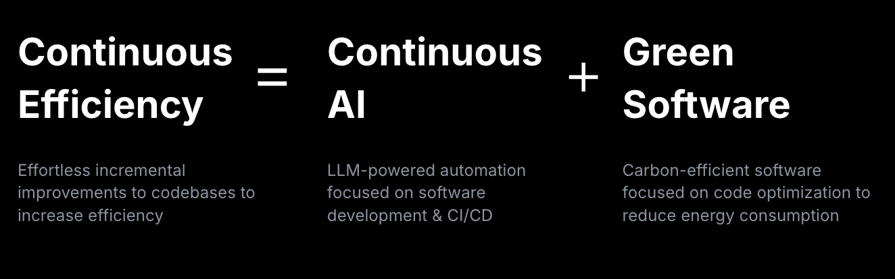

> [!NOTE]
> With AI-powered development tools, software teams can achieve continuous, automated, and incremental improvements in code efficiency and quality, while also advancing green and sustainable software development.

> [!TIP] Source link: [The future of AI-powered software optimization (and how it can help your team)](https://github.blog/news-insights/policy-news-and-insights/the-future-of-ai-powered-software-optimization-and-how-it-can-help-your-team/#h-making-the-case-for-continuous-efficiency)

<!-- more -->

 

---

 
 

When was the last time you heard someone ask in a standup, “ *How could we do this more sustainably?*”

Topics like green software and carbon efficiency are unfortunately rarely at the top of busy development teams’ priority lists. What’s more, there are very few “green software practitioners” out there. But we believe we’re at a unique moment in time where this can all change. The next generation of AI-enabled developer tooling has the opportunity to create near-effortless, always-on engineering for sustainability.

The [GitHub Next](https://githubnext.com/) and [GitHub Sustainability](https://github.com/social-impact/focus-areas/environmental-sustainability) teams have been collaborating to *prove this concept and value* through a series of internal and external pilot projects.

We call it Continuous Efficiency.

## Making the case for Continuous Efficiency

We believe that once it’s ready for broader adoption, Continuous Efficiency will have the potential to make a significant positive impact for developers, businesses, and sustainability.

### For developers

Digital sustainability and green software are intrinsically aligned to “efficiency,” which is at the core of software engineering. Many developers would benefit from performant software, better standardization of code, change quality assurance, and more.

### For businesses

Building for sustainability has measurable business value, including:

- Reducing power and resource consumption
- Increasing efficiency
- Better code quality
- Improved user experience
- Lower costs

Despite this, sustainability rarely makes it onto the roadmap, priority list, or even the backlog. But imagine a world in which the codebase could continuously improve itself…

A graphic showing Continuous Efficiency = Green Software + Continuous AI

Continuous Efficiency means effortless, incremental, validated improvements to codebases for increased efficiency. It’s an emergent practice based on a set of tools and techniques that we are starting to develop and hope to see the developer community expand on.

This emerges at the intersection of Continuous AI and Green Software.

[Continuous AI](https://githubnext.com/projects/continuous-ai/) is AI-enriched automation to software collaboration. We are exploring LLM-powered automation in platform-based software development and CI/CD workflows.

[Green Software](https://greensoftware.foundation/articles/what-is-green-software) is designed and built to be more energy-efficient and have a lower environmental impact. This practice tends to result in software that is cheaper, more performant, and more resilient.

## Continuous Efficiency in (GitHub) Action(s)

While Continuous Efficiency is a generally applicable concept, we have been building implementations on a specific GitHub platform and infrastructure called [Agentic Workflows](https://githubnext.com/projects/agentic-workflows). It’s publicly available and open source, but currently in “research demonstrator” status (read: experimental prototype, pre-release, subject to change and errors!). Agentic Workflows is an experimental framework for exploring proactive, automated, event-driven agentic behaviors in GitHub repositories, running safely in GitHub Actions.

Our work in this space has been focused on two areas:

1. **Implementing rules and standards**

With modern LLMs and agentic workflows, we can now express engineering standards and code-quality guidelines directly in natural language and apply them at a scale that was previously unattainable.

This capability goes far beyond traditional linting and static analysis approaches in three important ways:

- **Declarative, intent-based rule authoring**: you describe the intent in natural language and the model interprets and implements it (no need for hard-coded patterns or logic).
- **Semantic generalizability**: a single high-level rule can be applied across diverse code patterns, programming languages and architectures, giving far broader coverage than conventional tools and approaches.
- **Intelligent remediation**: this approach comprehensively resolves issues and violations through agentic, platform-integrated actions, like writing a pull request or adding comments and suggested edits to a change.

Examples of our work:

| **Case study: Code base reviews**   ***Green software rules implementation***      We have implemented a wide range of standard and specific Green Software rules, tactics and patterns. These can be applied fully agentically to entire codebases and repos.      **Example**:   We teamed up with the [resolve](https://github.com/browserify/resolve) project to scan their codebase with a number of rules, and agentically delivered proposed improvements.   The outputs weren’t all perfect—but one of the recently approved and merged pull requests makes a small performance improvement by “hoisting” RegExp literals from within hot functions.      The project gets 500M+ downloads per month on npm. So this small impact will scale! | **Case study: Implementing standards**   ***Web sustainability guidelines (WSG)***      The [W3C WSG](https://w3c.github.io/sustainableweb-wsg/) is a great resource to help people make web products and services more sustainable. We implemented the Web Development section into a set of 20 agentic workflows, so now the guidelines can be used by AI too!      **Example**:   We have run the WSG workflows on a number of GitHub and Microsoft web properties and found opportunities and built resolutions to improve them—ranging from deferred loading to using native browser features and latest language standards. |
| --- | --- |

  <video width="720" height="405" controls
    src="https://github.blog/wp-content/uploads/2025/12/Continuous-Efficiency-Resolve-Demo-Vid.mp4">
  </video>

1. **Heterogeneous performance improvement**

Performance engineering is notoriously difficult because real-world software is profoundly heterogeneous. Every repository brings a different mix of languages and architectures, and even within a single codebase, the sources of performance issues can span from algorithmic choices to cache behavior to network paths.

Expert performance engineers excel at navigating this complexity, but the sheer variety and volume of work across the industry demands better tooling and scalable assistance.

We’ve been thinking about the “grand challenge” of how to build a generic agent that can walk up to any piece of software and make demonstrable performance improvements. One that could navigate the vast ambiguity and heterogeneity of software in the wild—no small task!

Semi-automatic performance engineering aims to meet that need with an automated, iterative workflow where an agent researches, plans, measures, and implements improvements under human guidance. The process begins with “fit-to-repo” discovery—figuring out how to build, benchmark, and measure a given project—before attempting any optimization. Modern LLM-based agents can explore repositories, identify relevant performance tools, run microbenchmarks, and propose targeted code changes.

Early results vary quite dramatically, but some show promise that guided automation can meaningfully improve software performance at scale.

| **Case study:**   ***Daily perf improver***      Daily Perf Improver is a three-phase workflow, intended to run in small daily sprints. It can do things like:   (1) Research and plan improvements   (2) Infer how to build and benchmark the repository   (3) Iteratively propose measured optimizations      Example:On a focused recent pilot on `FSharp.Control.AsyncSeq` it has already delivered real gains by producing multiple accepted pull requests, including a rediscovered performance bug fix and verified microbenchmark-driven optimizations.      [Daily Perf Improver Research Demonstrator](https://github.com/githubnext/agentics/blob/main/workflows/daily-perf-improver.md) |
| --- |

## How to build and run agentic workflows

GitHub agentic workflows enable you to write automation in natural language (Markdown) instead of traditional YAML or scripts. You author a workflow in a `.md` file that begins with a YAML-like “front matter” (defining triggers, permissions, tools, safe-outputs, etc.), followed by plain-English instructions. At build time you run the `gh aw compile` command (part of the agentic workflows CLI) which compiles the Markdown into a standard GitHub Actions workflow (`.yml`) that can be executed by the normal GitHub Actions runtime.

When the compiled workflow runs, it launches an AI agent (for example via GitHub Copilot CLI, or other supported engines like Claude Code or OpenAI Codex) inside a sandboxed environment. The agent reads the repository’s context, applies the human-written natural-language instructions (for example “look for missing documentation, update `README` files, then open a pull request”), and produces outputs such as comments, pull requests, or other repository modifications. Because it’s running in the GitHub Actions environment, permission boundaries, safe-output restrictions, logs, auditability, and other security controls remain.

## How we build our Continuous Efficiency Workflows (with agents, of course!)

Our internal process for creating Continuous Efficiency workflows follows a simple, repeatable pattern:

1. **Define the intent**: based on a public standard or a domain-specific engineering requirement.
2. **Author the workflow in Markdown**: using structured natural language, guided interactively by the `create-agentic-workflow` agent.
3. **Compile to YAML**: turning the Markdown into a standard GitHub Actions workflow.
4. **Run in GitHub Actions**: executing the workflow on selected repositories

## Want to get involved in Continuous Efficiency?

If you’re a developer who loves the experimentation phase, you can already get started with running [agentic workflows](https://githubnext.github.io/gh-aw/) in GitHub Actions now! There are a range of examples that you can immediately try out (including a “Daily performance improver”) or author your own using natural language.

GitHub Sustainability will soon be publishing rulesets, workflows, and more—if you’re interested in being an early adopter or design partner, please [get in touch with me](https://support.github.com/contact/social-impact).
