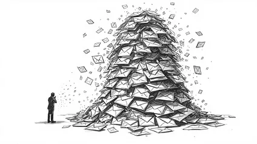
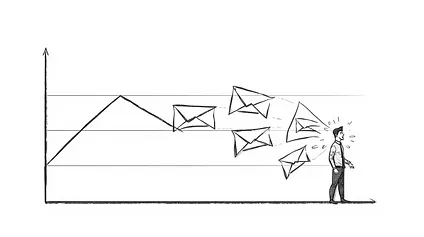
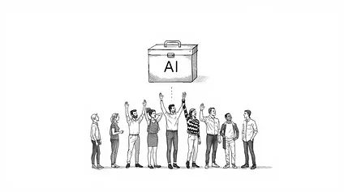
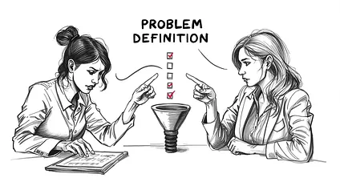

> [!NOTE]
> Now information spreads instantly. Being fast no longer creates leverage. It simply keeps you from falling behind.
>
> Once everyone has access, the advantage disappears. This raised the floor for everyone at the same time. Not gradually. All at once.
>
> Competence Became Infrastructure, AI did not make work easier. It made basic competence cheaper. And when competence becomes cheap, it stops being rewarded. That is why yesterday’s excellence feels invisible today.
>
> When one person can do the work of three, volume stops signaling value. It only signals access to tools.
>
> AI can scale messages, but it cannot build reputation at the same depth. AI cannot speed up indecision, humans can.
>
> A fast no is often better than a slow yes.
>
> People who keep trying to outperform machines at machine work lose. People who redesign the work around human judgment create separation again.

> [!TIP] Source link: [You're Not Getting Worse. Everyone Else Just Got AI](https://newsletter.jantegze.com/p/youre-not-getting-worse-everyone-else-got-ai)

<!-- more -->

 

---

 
 

## Your emails look better than ever. Reply rates dropped by half. You work harder but get less credit. AI didn't make you weaker. It made everyone else stronger

You stayed late. You cleared your inbox. You finished three projects ahead of schedule. Your manager nodded and moved on. Five years ago, that would have earned you recognition. Today, it barely gets noticed.

You sit down. You do the work. The same work that used to define strong performance.

And nothing happens.

Not because you got worse. Not because you stopped caring. But because the gap between effort and result quietly widened, and no one told you the standard moved.

Five years ago, a thoughtful email stood out. Today, your inbox is full of messages that look just as polished, many written or assisted by AI. What once felt personal now blends into noise.

Speed used to create advantage. Being first mattered because early meant visibility. Now information spreads instantly. Being fast no longer creates leverage. It simply keeps you from falling behind.

Volume lost its meaning too. Producing hundreds of outputs once signaled effort and drive. Today, automation tools can produce thousands. When activity becomes cheap, it stops being impressive. Your manager hears the numbers and shrugs, because motion is everywhere but progress is not.

You tried the obvious fixes. You doubled down on output. You bought better tools. You personalized harder. None of it restored the old baseline.

That is when the question starts to surface, usually late at night when you are still working: Am I losing my edge?

You are not.

The standard moved.

---

---

## Doubling Down Makes the Problem Worse

The first instinct is volume. If the work is not landing, do more of it. Send more emails. Take more meetings. Process more requests. Push harder.

The logic makes sense. More attempts mean more chances to break through. If reply rates dropped, increase the denominator.

But volume increases noise, and noise lowers trust.

When you send more, you also send more average work, even if you try to maintain quality. People start to feel like they are part of a campaign, not a conversation. Response rates drop, so you compensate by sending even more. Now your calendar fills with follow ups. Your task list becomes a blur. And you spend less time on the few moves that actually change outcomes, like clarifying priorities, tightening decision criteria, or aligning stakeholders.

The **system becomes a treadmill**. More output, same or worse result.

What actually breaks is signal. You stop learning what works because everything becomes activity. You cannot see patterns when the pattern is chaos.

The second common move is tools. If execution feels hard, buy software that makes it easier. The pitch is appealing. Automate repetitive work. Get insights faster. Scale your impact.

The problem is that **tools raise your throughput, but they also raise everyone else’s.**

If the **tool is widely available, it cannot be your edge. It just resets the baseline.** You get faster at producing the same mediocre outcomes.

Tools, like AI, also create a false sense of progress. Dashboards fill up. Automation runs. Metrics look healthy. But the actual constraint is often human. Unclear goals. Slow decisions. Misaligned expectations. Weak follow through. The tool optimizes the wrong part of the system.

What breaks here is accountability. Teams start blaming the market, the platform, or the process instead of fixing root causes like vague priorities or delayed feedback loops.

The third trap is hyper personalization, often assisted by AI. If generic does not work, go specific. Reference details. Show you did your homework. Make it feel custom.

Surface personalization does not equal relevance.

Adding a line about someone’s recent project or alma mater is easy now, and people know it. It can even feel manipulative when it is hyper specific but still misses the point. The real driver of engagement is usually fit and timing, plus a clear reason why this matters to them right now.

When personalization focuses on flattery instead of substance, it reads as templated charm. People disengage or reply with skepticism.

What breaks is trust. You think you are increasing warmth. They experience it as scripted.

All three approaches share the same flaw. **They try to outperform machines at machine work.**

That is a losing game.

Messages piling up with important signal buried under volume of output

## The Floor Rose for Everyone at Once

The real problem is not effort. It is leverage.

Five years ago, performance was limited by human speed. How fast you could research. How many drafts you could write. How thoroughly you could analyze. Effort scaled linearly. If you worked harder or were more skilled, you produced more output than others. That gap created advantage.

AI broke that relationship.

The system shifted from effort based leverage to tool based leverage. When a capability becomes automated, it stops being a differentiator and turns into infrastructure. Like email. Or spellcheck. Or search engines.

Once everyone has access, the advantage disappears.

This raised the floor for everyone at the same time. Not gradually. All at once.

Tasks that once required experience, training, and judgment can now be executed instantly at acceptable quality. Not perfect quality, but good enough. And in most systems, good enough is enough to compete.

The market no longer rewards execution alone. It rewards judgment about what to execute and why.

Here is what that looks like in practice.

Around 2019, a strong performer on a global team was known for one thing: response rate. She consistently hit 40 to 45 percent replies on outreach. That number mattered. Leaders tracked it weekly. High response rate meant strong communication skill. Low response rate triggered coaching.

It worked because writing good messages was hard. You had to understand context, read carefully, and phrase things like a human. Most people could not do that at scale, so the metric separated top performers from average ones.

Then automation and AI writing tools entered quietly.

Within a year, almost everyone’s messages looked better. Grammar improved. Tone improved. Structure improved. Reply rates briefly went up across the team.

Then something strange happened.

By the following quarter, reply rates dropped for everyone, including the best performers. Not a little. In some cases they fell by more than half. The same person went from 45 percent replies to under 20 percent, using messages that were objectively better written than before.

Nothing was wrong with her skill.

The signal collapsed.

People started assuming every message was automated. Even when it was not. They began scanning for relevance, not polish. If the context or timing was not right in the first two lines, they ignored it. Quality writing no longer bought attention.

The team reacted predictably. They rewrote templates. Added more personalization. Tested longer messages. Then shorter ones. They ran A/B tests. They added tools that promised smarter outreach.

None of it restored the old baseline.

Eventually leadership removed response rate as a primary performance metric. Not because it was unimportant, but because it no longer reflected individual skill. It reflected market saturation and tool access.

What replaced it was different. Speed to meaningful conversation. Conversion after first contact. Stakeholder satisfaction with outcomes. Fewer metrics, but closer to results.

That moment made the shift visible. A metric that once defined excellence became useless, not because people got worse, but because the system learned around it.

Declining response rate graph with recipient filtering through identical polished messages

## Competence Became Infrastructure

The standard moved because leverage moved.

That shift did not happen in isolation. It reflects a deeper change in how capability gets distributed.

For decades, work followed a predictable pattern. Skills were scarce. Training took time. **Experience created advantage.** Organizations competed by hiring people who could execute well.

Technology changed that gradually at first, then suddenly.

Email made communication instant. Spreadsheets made calculation accessible. Search engines made research democratic. Each wave automated a task that used to require skill, turning expertise into infrastructure.

AI accelerated that pattern.

The difference is scale and speed. Previous tools automated narrow tasks. AI automates entire categories of cognitive work. Writing. Analysis. Research. Design. Code. Not perfectly, but well enough to compete.

When competence becomes cheap, it stops being rewarded.

That is not a moral statement. It is structural.

Another force at play is asymmetry of scale. **One person with AI can now operate at the output level of several people from five years ago**. That compresses differentiation. When one person can do the work of three, volume stops signaling value. It only signals access to tools.

There is also signal inflation. When everyone can produce polished content, polished stops meaning competent. Clean deliverables, articulate communication, and fast responses used to signal care and skill. Now they mostly signal assistance. The signal still exists, but its credibility dropped.

At the same time, decision makers adapted. Audiences learned to filter. Managers learned to distrust surface quality. Leaders learned that activity metrics lie. When perception adjusts, standards rise automatically.

**No one decided to raise the bar. The system did.**

The counterintuitive truth is this: **AI did not make work easier. It made basic competence cheaper.** And when competence becomes cheap, it stops being rewarded.

That is why yesterday’s excellence feels invisible today.

AI toolbox raising baseline floor for all performers simultaneously to same level

## Stop Competing on Execution

The people who still create separation did not get better at doing more. They changed where they apply judgment.

That is the new advantage.

Here are four adaptations that actually work, and why.

- **First**, move upstream closer to problem definition. Average performers focus on completing tasks. Strong performers shape them. They challenge vague briefs. They force clarity on priorities versus distractions. They pressure test assumptions, timelines, and constraints before work starts.

	This creates leverage because AI cannot fix a badly defined problem. If the goal is wrong, no amount of execution will save it. People who influence the input get advantage before the system even runs.

	In practice, this means asking harder questions earlier. What are we actually trying to solve? What would success look like if we had no constraints? What is the real blocker here? These questions feel slow at first, but they prevent rework later. And rework is where time dies.

- **Second**, optimize for decisions, not activity. Stop asking how much did we produce and start asking how fast can we get a real yes or no. Shorten feedback loops. Chase clarity harder than completion. Design processes that reduce waiting. This creates separation because most delays are internal, not external. AI cannot speed up indecision. Humans can.

	The shift here is subtle but critical. It means treating speed to resolution as more valuable than speed to output. A fast no is often better than a slow yes. Waiting costs more than most people calculate.

- **Third**, build credibility, not just reach. Top performers invest in being known before they need something. They show up consistently. They educate their audience. They create familiarity. When they make a request later, it does not start cold.

	This works because trust compounds while automation does not. AI can scale messages, but it cannot build reputation at the same depth. Familiarity lowers resistance before the conversation even begins.

	This does not mean posting constantly or networking aggressively. It means being useful over time. Sharing what you learn. Helping without asking for anything back. Making small deposits that add up.

- **Fourth**, measure what AI cannot fake. Track outcomes that require human alignment. Quality of decisions. Stakeholder satisfaction. Time lost to confusion or rework. Conversion rates that depend on trust. These metrics expose thinking, not typing. When you measure judgment, people improve judgment. When you measure activity, people game activity.

The pattern underneath all four is the same.

Execution got automated. Judgment did not!

**People who keep trying to outperform machines at machine work lose**. People who redesign the work around human judgment create separation again.

Minimal line art sketch illustration, two workers side by side, one frantically typing and checking boxes on tasks, the other calmly pointing upstream at a funnel labeled "problem definition," black and white with clean negative space, editorial style

## The Advantage Shifted, Not Disappeared

This is not a story about decline. It is a story about recalibration.

The skills that built careers five years ago were real. They mattered. They still matter in many contexts. But the system changed faster than most organizations adapted their expectations.

What used to be scarce is now abundant. What used to signal excellence now signals access. That does not mean effort is worthless. It means effort alone is no longer enough.

The gap you feel between working hard and getting results is not personal failure. It is structural friction. The old playbook stopped working because the game changed.

The good news is that **judgment, context, and alignment cannot be automated yet.** Maybe they never will be. Those are still human advantages. The people who win in this environment are the ones who stopped trying to be faster typists and started being better thinkers.

That shift is uncomfortable. It requires letting go of metrics and habits that once defined competence. It means accepting that some of what made you valuable before is now table stakes.

But it also means the ceiling is higher than it used to be. When execution becomes infrastructure, the leverage moves to strategy, prioritization, and influence. Those are harder to build, but they compound differently.

The standard has moved. That is real. But so is the opportunity to build an advantage in a new place.

You just have to stop looking for it where it used to be.
